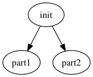
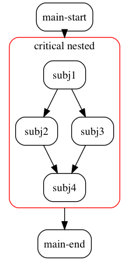

<style>div.title-slide {    width: 100%;    display: flex;    flex-direction: row;            /* default value; can be omitted */    flex-wrap: nowrap;              /* default value; can be omitted */    justify-content: space-between;}</style><div class="title-slide">
<span style="float:left;">Licence CC BY-NC-ND</span>
<span>Thierry Parmentelat - Inria</span>
<span></span>
</div>

# README

## A simplistic orchestration engine

The main and single purpose of this library is to allow for the static description of a scenario involving `asyncio`-compliant jobs, that have dependencies in the sense that a given job cannot start until its requirements have not completed.

So in a nutshell you would:

* define a set of `Job` objects, 
* together with their `requires` relationship; that is to say, for each of them, which other jobs need to have completed before this one can be triggered,
* and run this logic through an `Scheduler` object, that will orchestrate the whole scenario.

Further features allow to

* define a job as running `forever`, in which case the scheduler of course won't wait for it, but instead will terminate it when all other jobs are done;
* define a job as `critical`; a critical job that raises an exception causes the orchestration to terminate abruptly;
* define a global `timeout` for the whole scheduler;
* define a *window* in terms of a maximal number of simultaneous jobs that are allowed to run.


A job object can be created:

* either as a `Job` instance from a regular asyncio coroutine
* or by specializing the `AbstractJob` class and defining its `co_run()` method

As a convenience, the `Sequence` class is mostly a helper class that can free you from manually managing the `requires` deps in long strings of jobs.

## Full documentation

This document, along with API reference doc, and changelog, is available at <http://asynciojobs.readthedocs.io>

Contact author : *thierry dot parmentelat at inria dot fr*

## Prerequisites

`asynciojobs` requires `asyncio` and python-3.5.


```python
import sys
major, minor = sys.version_info[:2]
if (major, minor) < (3, 5):
    print("asynciojobs won't work in this environment")
```

## Installing

`asynciojobs` requires python-3.5, and can be installed from the pypi repository:

```
pip3 install asynciojobs
```

## Examples


```python
import asyncio
```

Let's consider a simple coroutine for the sake of illustration


```python
import time

# just print a message when entering and exiting, and sleep in the middle
async def in_out(timeout):
    print("-> in_out({})".format(timeout))
    await asyncio.sleep(timeout)
    print("<- in_out({})".format(timeout))
    # return something easy to recognize: the number of milliseconds
    return 1000 * timeout
```

### Example A : running in parallel

Running a series of coroutines in parallel - a la `gather` - can be done like this


```python
from asynciojobs import Job, Scheduler
```


```python
a1, a2, a3 = Job(in_out(0.1)), Job(in_out(0.2)), Job(in_out(0.25)),
```

What we're saying here is that we have three jobs, that have no relationships between them. 

So when we run them, we would start all 3 coroutines at once, and return once they are all done:


```python
sa = Scheduler(a1, a2, a3)
sa.run()
```

    -> in_out(0.2)
    -> in_out(0.25)
    -> in_out(0.1)
    <- in_out(0.1)
    <- in_out(0.2)
    <- in_out(0.25)


    True


### Retrieving individual results

We can see right away how to retrieve the results of the various jobs


```python
a1.result()
```


    100.0


### Example B : adding requirements (dependencies)

Now we can add *requirements* dependencies between jobs, like in the following example. Here we want to run:
 
* Job 1 followed by job 2
* all this in parallel with job 3

We take this chance to show that jobs can be tagged with a label, which can be convenient sometimes.


```python
b1, b2, b3 = (Job(in_out(0.1), label="b1"),
              Job(in_out(0.2), label="b2"),
              Job(in_out(0.25)))

b2.requires(b1)
```

Now `b2` needs `b1` to be finished before it can start. And so only the 2 first coroutines get started at the beginning, and only once b1 has finished does b2 start.


```python
# with this setup we are certain that b3 ends in the middle of b2
sb = Scheduler(b1, b2, b3)
sb.run()
```

    -> in_out(0.25)
    -> in_out(0.1)
    <- in_out(0.1)
    -> in_out(0.2)
    <- in_out(0.25)
    <- in_out(0.2)


    True


### Example B' : exact same using a `Sequence`

The code above in example B is exactly identical to this


```python
from asynciojobs import Sequence

sb2 = Scheduler(Sequence(Job(in_out(0.1), label="bp1"),
                      Job(in_out(0.2), label="bp2")),
             Job(in_out(0.25)))

sb2.run()
```

    -> in_out(0.25)
    -> in_out(0.1)
    <- in_out(0.1)
    -> in_out(0.2)
    <- in_out(0.25)
    <- in_out(0.2)


    True


### Return value for `Scheduler.run()` 

Note that because `sb.run()` had returned `True`, we could have inferred that all jobs have completed. As a matter of fact, `run()` returns `True` if and only if:

* all jobs have completed during the allocated timeout
* no critical job has raised an exception

### Inspecting scheduler and results - `Scheduler.list()`

Before we see more examples, let's see more ways to get information about what happened once `run` finishes.
For example to check that job `b1` has completed:


```python
print(b1.is_done())
```

    True


To check that job `b3` has not raised an exception:


```python
print(b3.raised_exception())
```

    None


To see an overview of a scheduler, just use the `list()` method that will give you an overview - whether the scheduler has run or not, by the way:


```python
sb.list()
```

    1   ☉ ☓   <Job `Job[in_out (...)]`> 
    2   ☉ ☓   <Job `b1`> 
    3   ☉ ☓   <Job `b2`> requires={2}


Here is a complete list of the symbols used, with their meaning 

* `⚐` : idle (read: requirements are not fulfilled)
* `⚑` : scheduled (read: waiting for a slot in the jobs window)
* `↺` : running
* `☓` : complete 
* `★` : raised an exception
* `☉` : went through fine (no exception raised)
* `⚠` : defined as critical
* `∞` : defined as forever  


And and here's an example of output for `list()` with all possible combinations of jobs:

```
01 ⚠   ⚐ ∞ <J `forever=True crit.=True status=idle boom=False`>
02 ⚠   ⚐   <J `forever=False crit.=True status=idle boom=False`> - requires {01}
03     ⚐ ∞ <J `forever=True crit.=False status=idle boom=False`> - requires {02}
04     ⚐   <J `forever=False crit.=False status=idle boom=False`> - requires {03}
05 ⚠   ⚑ ∞ <J `forever=True crit.=True status=scheduled boom=False`> - requires {04}
06 ⚠   ⚑   <J `forever=False crit.=True status=scheduled boom=False`> - requires {05}
07     ⚑ ∞ <J `forever=True crit.=False status=scheduled boom=False`> - requires {06}
08     ⚑   <J `forever=False crit.=False status=scheduled boom=False`> - requires {07}
09 ⚠ ☉ ↺ ∞ <J `forever=True crit.=True status=running boom=False`> - requires {08}
10 ⚠ ☉ ↺   <J `forever=False crit.=True status=running boom=False`> - requires {09}
11   ☉ ↺ ∞ <J `forever=True crit.=False status=running boom=False`> - requires {10}
12   ☉ ↺   <J `forever=False crit.=False status=running boom=False`> - requires {11}
13 ⚠ ★ ☓ ∞ <J `forever=True crit.=True status=done boom=True`>!! CRIT. EXC. => bool:True!! - requires {12}
14 ⚠ ★ ☓   <J `forever=False crit.=True status=done boom=True`>!! CRIT. EXC. => bool:True!! - requires {13}
15   ★ ☓ ∞ <J `forever=True crit.=False status=done boom=True`>!! exception => bool:True!! - requires {14}
16   ★ ☓   <J `forever=False crit.=False status=done boom=True`>!! exception => bool:True!! - requires {15}
17 ⚠ ☉ ☓ ∞ <J `forever=True crit.=True status=done boom=False`>[[ -> 0]] - requires {16}
18 ⚠ ☉ ☓   <J `forever=False crit.=True status=done boom=False`>[[ -> 0]] - requires {17}
19   ☉ ☓ ∞ <J `forever=True crit.=False status=done boom=False`>[[ -> 0]] - requires {18}
20   ☉ ☓   <J `forever=False crit.=False status=done boom=False`>[[ -> 0]] - requires {19}
```

Note that if your locale/terminal cannot output these, the code will tentatively resort to pure ASCII output.

### Example C : infinite loops, or coroutines that don't return

Sometimes it is useful to deal with a endless loop; for example if we want to separate completely actions and printing, we can use an `asyncio.Queue` to implement a simple message bus as follows


```python
message_bus = asyncio.Queue()

async def monitor_loop(bus):
    while True:
        message = await bus.get()
        print("BUS: {}".format(message))
```

Now we need a modified version of the previous coroutine, that interacts with this message bus instead of printing anything itself&nbsp;:


```python
async def in_out_bus(timeout, bus):
    await bus.put("-> in_out({})".format(timeout))
    await asyncio.sleep(timeout)
    await bus.put("<- in_out({})".format(timeout))
    # return something easy to recognize
    return 10 * timeout
```

We can replay the prevous scenario, adding the monitoring loop as a separate job; however we need to declare this job with `forever=True` so that the scheduler knows it does not have to wait for the monitoring loop, that will never return.


```python
c1, c2, c3, c4 = (Job(in_out_bus(0.2, message_bus), label="c1"),
                  Job(in_out_bus(0.4, message_bus), label="c2"), 
                  Job(in_out_bus(0.3, message_bus), label="c3"),
                  Job(monitor_loop(message_bus), forever=True, label="monitor"))

c3.requires(c1)

sc = Scheduler(c1, c2, c3, c4)
sc.run()
```

    BUS: -> in_out(0.4)
    BUS: -> in_out(0.2)
    BUS: <- in_out(0.2)
    BUS: -> in_out(0.3)
    BUS: <- in_out(0.4)
    BUS: <- in_out(0.3)


    True


Note that `run()` always terminates as soon as all the non-`forever` jobs are complete. The `forever` jobs, on the other hand, get cancelled, so of course no return value is available at the end of the scenario&nbsp;:


```python
sc.list()
```

    1   ☉ ↺ ∞ <Job `monitor`> 
    2   ☉ ☓   <Job `c2`> 
    3   ☉ ☓   <Job `c1`> 
    4   ☉ ☓   <Job `c3`> requires={3}


### Example D : specifying a global timeout

`run()` accepts a `timeout` argument in seconds. When provided, `run()` will ensure its global duration does not exceed this value, and will return `False` if the timeout triggers.

Of course this can be used with any number of jobs and dependencies, but for the sake of simplicity let us see this in action with just one job that loops forever


```python
async def forever():
    for i in range(100000):
        print("{}: forever {}".format(time.strftime("%H:%M:%S"), i))
        await asyncio.sleep(.1)
        
j = Job(forever(), forever=True)
sd = Scheduler(j)
sd.run(timeout=0.25)
```

    19:01:04: forever 0
    19:01:04: forever 1
    19:01:04: forever 2
    19:01:04.480 SCHEDULER: Scheduler.co_run: TIMEOUT occurred


    False


As you can see the result of `run()` in this case is `False`, since not all jobs have completed. Apart from that the jobs is now in this state:


```python
j
```


      ☉ ↺ ∞ <Job `Job[forever (...)]`> [not done] 


### Handling exceptions

A job instance can be **critical** or not; what this means is as follows

 * if a critical job raises an exception, the whole scheduler aborts immediately and returns False
 * if a non-critical job raises an exception, the whole scheduler proceeds regardless
 
In both cases the exception can be retrieved in the corresponding Job object with `raised_exception()`

For convenience, the **critical** property can be set either at the `Job` or at the `Scheduler` level. Of course the former takes precedence if set. The default for an scheduler object is `critical=False`. Let us see this below.

### Example E : non critical jobs


```python
async def boom(n):
    await asyncio.sleep(n)
    raise Exception("boom after {}s".format(n))
```


```python
# by default everything is non critical
e1 = Job(in_out(0.2))
e2 = Job(boom(0.2), label="boom")
e3 = Job(in_out(0.3))
e2.requires(e1)
e3.requires(e2)

se = Scheduler(e1, e2, e3)
print("orch:", se.run())
se.list()
```

    -> in_out(0.2)
    <- in_out(0.2)
    -> in_out(0.3)
    <- in_out(0.3)
    orch: True
    1   ☉ ☓   <Job `Job[in_out (...)]`> 
    2   ★ ☓   <Job `boom`> requires={1}
    3   ☉ ☓   <Job `Job[in_out (...)]`> requires={2}


### Example F : critical jobs

Making the *boom* job critical would instead cause the scheduler to bail out:


```python
f1 = Job(in_out(0.2))
f2 = Job(boom(0.2), label="boom", critical=True)
f3 = Job(in_out(0.3))

sf = Scheduler(Sequence(f1, f2, f3))
print("run:", sf.run())
sf.list()
```

    -> in_out(0.2)
    <- in_out(0.2)
    19:01:05.652 SCHEDULER: Emergency exit upon exception in critical job
    run: False
    1   ☉ ☓   <Job `Job[in_out (...)]`> 
    2 ⚠ ★ ☓   <Job `boom`> requires={1}
    3     ⚐   <Job `Job[in_out (...)]`> requires={2}


### Limiting the number of simultaneous jobs

`run()` accepts an optional argument `jobs_window` that allows to specify a maximum number of jobs running simultaneously. 

When `jobs_windows` is not specified or `0`, it means no limit is imposed on the running jobs.


```python
# let's define a simple coroutine
async def aprint(message, delay=0.5):
     print(message)
     await asyncio.sleep(delay)
```


```python
# let us now add 8 jobs that take 0.5 second each
s = Scheduler()

for i in range(1, 9):
    s.add(Job(aprint("{}-th job".format(i), 0.5)))
```


```python
# so running them with a window of 4 means approx. 1 second
import time
beg = time.time()
s.run(jobs_window = 4)
end = time.time()

# expect around 1 second
print("total duration = {}s".format(end-beg))
```

    7-th job
    2-th job
    6-th job
    3-th job
    1-th job
    4-th job
    8-th job
    5-th job
    total duration = 1.0038080215454102s


## Customizing jobs

### Customizing the `Job` class

`Job` actually is a specializtion of `AbstractJob`, and the specification is that the `co_run()` method should denote a coroutine itself, as that is what is triggered by `Scheduler` when running said job.

### `AbstractJob.co_shutdown()`

Before returning, `run()` sends the `co_shutdown()` method on all jobs. The default behaviour - in the `Job` class - is to do nothing, but this can be redefined when relevant. Typically, an implementation of an `SshJob` will allow for a given SSH connection to be shared amongs several `SshJob` instances, and so `co_shutdown()` may be used to  close the underlying SSH connections at the end of the scenario.

### The `apssh`  library and the ` SshJob` class

You can easily define your own `Job` class by specializing `job.AbstractJob`. As an example, which was the primary target when developping `asynciojobs`, you can find [in the `apssh` library](https://github.com/parmentelat/apssh) a `SshJob` class, with which you can easily orchestrate scenarios involving several hosts that you interact with using ssh.

## Other useful features on the `Scheduler` class

###  Inspect / troubleshoot : `Scheduler.debrief()`

`Scheduler.debrief()` is designed for schedulers that have run and returned `False`, it does output the same listing as `list()` but with additional statistics on the number of jobs, and, most importantly, on the stacks of jobs that have raised an exception.

### Cleanup : `Scheduler.sanitize()`

In some cases like esp. test scenarios, it can be helpful to add requirements to jobs that are not in the scheduler. The `sanitize` method removes such extra requirements, and unless you are certain it is not your case, it might be a good idea to call it explcitly before an orchestration.

### Early checks : `Scheduler.rain_check()`

`rain_check` will check for cycles in the requirements graph. It returns a boolean. It's a good idea to call it before running an orchestration.

### Need a coroutine instead ? : `Scheduler.co_run()` 

`run()` is a regular `def` function (i.e. not an `async def`), but in fact just a wrapper around the native coroutine called `co_run()`.

    def run(self, loop=None, *args, **kwds):
        if loop is None:
            loop = asyncio.get_event_loop()
        return loop.run_until_complete(self.co_run(loop=loop, *args, **kwds))

### Visualization - in a notebook : `Scheduler.graph()`

If you have the `graphviz` package installed, you can inspect a scheduler instance in a Jupyter notebook by using the `graph()` method, that returns a `graphviz.Digraph` instance; this way the scheduler graph can be displayed interactively in a notebook - see also <http://graphviz.readthedocs.io/en/stable/manual.html#jupyter-notebooks>.

Here's a simple example:


```python
# and a simple scheduler with an initialization and 2 concurrent tasks
s = Scheduler()
j1 = Job(aprint("j1"), label="init", scheduler=s)
j2 = Job(aprint("j2"), label="part1", scheduler=s, required=j1)
j3 = Job(aprint("j3"), label="part2", scheduler=s, required=j1)
s.graph()
```


In a regular notebook, that is all you need to do to see the scheduler's graph.
In the case of this README though, once rendered on `readthedocs.io` the graph has got lost in translation, so please read on to see that graph.

### Visualization - the long way : `Scheduler.export_as_dotfile()`

If visualizing in a notebook is not an option, or if you do not have graphviz installed, you can still produce a dotfile from a scheduler object:


```python
s.export_as_dotfile('readme.dot')
```


    '(Over)wrote readme.dot'


Then later on - and possibly on another host - you can use this dot file as an input to produce a `.png` graphics, using the `dot` program (which is part of `graphviz`), like e.g.:


```python
import os
os.system("dot -Tpng readme.dot -o readme.png")
```


    0


Which now allows us to render the graph for our last scheduler as a png file:



Note that if you do have `graphviz` available, you can produce a png file more simply, i.e. without the need for creating the dot file, as shown below:


```python
# a trick to produce a png file on a box that has graphviz pip-installed
g = s.graph()
g.format = 'png'
g.render('readme')
```


    'readme.png'


## Nesting schedulers

By simply taking advantage of the fact that:
* a `Job` can be created from any coroutine, and that
* `Scheduler.co_run` is a coroutine, 

it is easy to nest schedulers.

### The `SchedulerJob` class

In order to make such constructions a little more explicit though, `asynciojobs` comes with a dedicated class called `SchedulerJob`. 

This class is a mere mixin between `Scheduler` and `AbstractJob`. Being at the same time a `Scheduler` and an `AbstractJob`, it can be inserted in the main scheduler, and (sub-)jobs can be added to it.


```python
from asynciojobs import SchedulerJob
```

Consider the following example:


```python
# we start with the creation of an internal scheduler
# that has a simple diamond structure
# note the use of SchedulerJob and not just simply Scheduler

sub_sched = SchedulerJob()
subj1 = Job(aprint("subj1"), label='subj1', scheduler=sub_sched)
subj2 = Job(aprint("subj2"), label='subj2', required=subj1, scheduler=sub_sched)
subj3 = Job(aprint("subj3"), label='subj3', required=subj1, scheduler=sub_sched)
subj4 = Job(aprint("subj4"), label='subj4', required=(subj2, subj3), scheduler=sub_sched)
```

We can now create a main scheduler, in which one of the jobs **is** this low-level scheduler:


```python
# the main scheduler
sub_sched.label = "nested"
main_sched = Scheduler(
    Sequence(
        Job(aprint("main-start"), label="main-start"),
        # the way to graft the low-level logic in this main workflow
        # is to just use the ShcdulerJOb instance as a job
        sub_sched,
        Job(aprint("main-end"), label="main-end"),
    )
)
```

This nested structure is rendered by both `list()` and `graph()`:


```python
# list() shows the contents of sub-schedulers implemented as SchedulerJob instances
main_sched.list()
```

    1     ⚐   <Job `main-start`> 
    2     ⚐   > <SchedulerJob `nested`> requires={1} -> entries={3}
    3     ⚐   <Job `subj1`> 
    4     ⚐   <Job `subj2`> requires={3}
    5     ⚐   <Job `subj3`> requires={3}
    6     ⚐   <Job `subj4`> requires={4, 5}
    2   end   < <SchedulerJob `nested`> exits={6}
    7     ⚐   <Job `main-end`> requires={2}


When using a `SchedulerJob` to describe nested schedulers, `asynciojobs` will also produce a graphical output that properly exhibits the overall structure; this example requires the `graphviz` package:


```python
main_dot = main_sched.graph()
main_dot.format = 'png'
main_dot.render("readme-nested")
```


    'readme-nested.png'


That we now visualize; again, from a live notebook it is enough to evaluate ``main_sched.graph()`` to see that picture:



Which when executed produces this output:


```python
main_sched.run()
```

    main-start
    subj1
    subj2
    subj3
    subj4
    main-end


    True


### What for ?

This feature can can come in handy to deal with issues like:

* you want to be able to re-use code - as in writing a library - and for that SchedulerJob is a convenient way to address that; functions can return pieces of workflows that can be easily mixed within a larger scenario.

* in another dimension, nested schedulers can be a solution if
  * you want the `jobs_window` attribute of `co_run()` to apply to only a subset of your jobs;
  * you want the `timeout` attirbute of `co_run()` to apply to only a subset of your jobs;
  * you have `forever` jobs that need to be terminated sooner than the very end of the overall scenario.


## Troubleshooting

As a general rule, and maybe especially when dealing with nested schedulers, it is important to keep in mind the following constraints.

### Don't insert a job in several schedulers

One given job should be inserted in **exactly one** scheduler. Be aware that the code does not check for this, it is the programmer's responsability to enforce this rule. 

A job that is not inserted in any scheduler will of course never be run. 

A job inserted in several schedulers will most likely behave very oddly, as each scheduler will be in a position to have it move along.


### Create as many job instances as needed

Another common mistake is to try and reuse a job instance in several places in a scheduler. Each instance carries the state of the job progress, so it is important to create as many instances/copies as there are tasks, and to not try and share job objects.

In particular, if you take one job instance that has completed, and try to insert it into a new scheduler, it will be considered as done, and will not run again.

### You can't run the same scheduler twice

In much the same way, once a scheduler is done - assuming all went well - essentially all of its jobs are marked as done, and trying to run it again will either do nothing, or raise an exception.

### You can't run an empty scheduler

As of this writing, trying to run an empty scheduler results in an exception, as no entry point can be found in the requirements graph. This might change in the future though.
