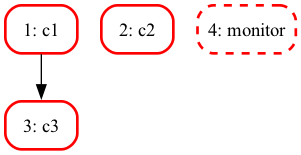
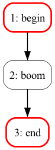
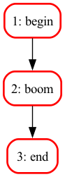
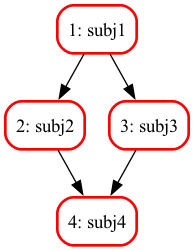
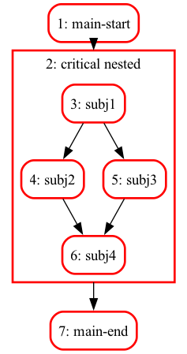

# README

## A simple orchestration engine for `asyncio`

The main and single purpose of this library is to allow for the static description of scenarii involving `asyncio`-compliant jobs, that have dependencies in the sense that a given job cannot start until its requirements have not completed.

So in a nutshell you would:

* define a set of `Job` objects, 
* together with their `requires` relationship; that is to say, for each of them, which other jobs need to have completed before this one can be triggered,
* and run this logic through an `Scheduler` object, that will orchestrate the whole scenario.

Further features allow to

* define a job as *critical* or not; a critical job that raises an exception causes the orchestration to terminate abruptly;
* define a job as running *forever*, in which case the scheduler of course won't wait for it, but instead will terminate it when all other jobs are done;
* define a global `timeout` for the whole scheduler;
* define a *window* in terms of a maximal number of simultaneous jobs that are allowed to run;
* define *nested* schedulers: a `Scheduler` instance being also a job, a scheduler can be inserted in another scheduler just as if it were a re gular job; nested schedulers allow for reusability, since workflow pieces can be for example returned by regular python functions.

A job object can be created:

* either as a `Job` instance from a regular asyncio coroutine;
* or by specializing the `AbstractJob` class, and defining its `co_run()` method; this is for example the case for the `SshJob` in the [`apssh` library](http://apssh.readthedocs.io).

As a convenience, the `Sequence` class is a helper class that can free you from manually managing the `requires` deps in long strings of jobs that must run sequentially.

## Full documentation

This document, along with `asynciojobs`'s API reference documentation, and changelog, is available at <http://asynciojobs.readthedocs.io>

**Contact author**: *thierry dot parmentelat at inria dot fr*

**Licence**: CC BY-NC-ND

## Installing

`asynciojobs` can be installed from the pypi repository:

```
pip install asynciojobs
```

### Extra dependencies 

- `pip install "asynciojobs[graph]"`
  if you intend on using graphviz for visualizing graphs in notebooks
- `pip install "asynciojobs[ordered]"
  if you want asynciojobs to create ordered sets instead of regular sets
- see also `pyproject.toml` for other more dev-oriented extra deps

## Examples


```python
import asyncio
```

In all our examples, we will use the `Watch` class, it is a helper class that works like a stopwatch; instead of printing the current time, we prefer to display running time from the *beginning*, which corresponds to the time where the watch instance is created or reset:


```python
import time
from asynciojobs import Watch

watch = Watch()
time.sleep(0.5)
watch.print_elapsed('some')
```

    000.000  


    000.500 some

We can now write a simple coroutine for illustrating schedulers through small examples:


```python
import time

watch = Watch()

# just print a message when entering and exiting, and sleep in the middle
async def in_out(timeout):
    global watch
    watch.print_elapsed("-> in_out({})\n".format(timeout))
    await asyncio.sleep(timeout)
    watch.print_elapsed("<- in_out({})\n".format(timeout))
    # return something easy to recognize: the number of milliseconds
    return 1000 * timeout
```

    000.000  


### Example A : running in parallel

Running a series of coroutines in parallel - a la `gather` - can be done like this:


```python
from asynciojobs import Job, Scheduler
```


```python
a1, a2, a3 = Job(in_out(0.1)), Job(in_out(0.2)), Job(in_out(0.25)),
```

What we're saying here is that we have three jobs, that have no relationships between them. 

So when we run them, we would start all 3 coroutines at once, and return once they are all done:


```python
# this is required in our case because our coroutines
# use watch to show time elapsed since reset()
watch.reset()

sa = Scheduler(a1, a2, a3)
sa
```


    Scheduler with 0 done + 0 ongoing + 3 idle = 3 job(s)


```python
await sa.co_run()
```

    000.021 -> in_out(0.25)
    000.021 -> in_out(0.1)
    000.021 -> in_out(0.2)
    000.121 <- in_out(0.1)


    000.222 <- in_out(0.2)
    000.271 <- in_out(0.25)


    True


**Note**: here we take advantage of IPython's ability to perform `await`s right at the toplevel; there's also a `run()` method on schedulers, that is a regular - blocking - Python function. As of release 0.19, `asynciojobs` no longer explicitly calls `get_event_loop()` because its use is way too ambiguous nowadays.

### Several programming styles

The library offers great flexibility for creating schedulers and jobs. In particular in the example above, we have created the jobs first, and then added them to the scheduler; it is possible to do it the other way around, like this totally equivalent construction:


```python
# if it is more to your taste, you can as well
# create the scheduler first
sa2 = Scheduler()

# and then add jobs in it as you create them
a1, a2 = Job(in_out(0.1), scheduler=sa2), Job(in_out(0.2), scheduler=sa2)

# or add them later on
a3 = Job(in_out(0.25))
sa2.add(a3)
```


    ⚠   ⚐   <Job `Job[in_out (...)]`> [not done] 


```python
watch.reset()
await sa2.co_run()
```

    000.000 -> in_out(0.1)
    000.000 -> in_out(0.2)
    000.000 -> in_out(0.25)
    000.101 <- in_out(0.1)


    000.201 <- in_out(0.2)
    000.251 <- in_out(0.25)


    True


### Retrieving individual results

We can see right away how to retrieve the results of the various jobs


```python
a1.result()
```


    100.0


### Example B : adding requirements (dependencies)

Now we can add *requirements* dependencies between jobs, as follows. Here we want to run:
 
* job 1 followed by job 2
* all this in parallel with job 3

We take this chance to show that jobs can be tagged with a label, which can be convenient for a more friendly display.


```python
b1, b2, b3 = (Job(in_out(0.1), label="b1"),
              Job(in_out(0.2), label="b2"),
              Job(in_out(0.25)))

b2.requires(b1)
```


    ⚠   ⚐   <Job `b2`> [not done] requires={??}


Now `b2` needs `b1` to be finished before it can start. And so only the 2 first coroutines get started at the beginning, and only once b1 has finished does b2 start.


```python
watch.reset()

# with this setup we are certain that b3 ends in the middle of b2
sb = Scheduler(b1, b2, b3)
await sb.co_run()
```

    000.000 -> in_out(0.25)
    000.000 -> in_out(0.1)


    000.101 <- in_out(0.1)
    000.102 -> in_out(0.2)


    000.252 <- in_out(0.25)


    000.302 <- in_out(0.2)


    True


### Example B' : exact same using a `Sequence`

The code above in example B is exactly identical to this:


```python
from asynciojobs import Sequence

sb2 = Scheduler(
    Sequence(Job(in_out(0.1), label="bp1"),
             Job(in_out(0.2), label="bp2")),
    Job(in_out(0.25)))
```


```python
watch.reset()

await sb2.co_run()
```

    000.000 -> in_out(0.25)
    000.000 -> in_out(0.1)
    000.101 <- in_out(0.1)
    000.102 -> in_out(0.2)


    000.251 <- in_out(0.25)
    000.302 <- in_out(0.2)


    True


### Return value for `Scheduler.run()` 

Note that because `sb.run()` had returned `True`, we could have inferred that all jobs have completed. As a matter of fact, `run()` returns `True` **if and only if**:

* all jobs have completed during the allocated timeout, if specified, and
* no critical job has raised an exception.

**Note**:

What happens if these two conditions are not met depends on the `critical` attribute on the scheduler object:

* if scheduler is **not critical**: then if any of these conditions is not met, `run()` **returns `False`**;
* if scheduler is itself **critical**, then `run()` will **raise an exception**, depending on the reason behind the failure, see [co_run()](http://asynciojobs.readthedocs.io/en/latest/API.html#asynciojobs.scheduler.Scheduler.co_run) for details.

This behaviour has been chosen so that nested schedulers do the right thing: it allows exceptions to bubble from inner schedulers up to the toplevel one, and to trigger its abrupt termination.

See also [failed_critical()](http://asynciojobs.readthedocs.io/en/latest/API.html#asynciojobs.purescheduler.PureScheduler.failed_critical), 
[failed_time_out()](http://asynciojobs.readthedocs.io/en/latest/API.html#asynciojobs.purescheduler.PureScheduler.failed_time_out),
[debrief()](http://asynciojobs.readthedocs.io/en/latest/API.html#asynciojobs.purescheduler.PureScheduler.debrief)
and [why()](http://asynciojobs.readthedocs.io/en/latest/API.html#asynciojobs.purescheduler.PureScheduler.why).

### Inspecting scheduler and results - `Scheduler.list()`

Before we see more examples, let's see more ways to get information about what happened once `run` finishes.
For example to check that job `b1` has completed:


```python
print(b1.is_done())
```

    True


To check that job `b3` has not raised an exception:


```python
print(b3.raised_exception())
```

    None


To see an overview of a scheduler, just use the `list()` method that will summarize the contents of a scheduler:


```python
sb.list()
```

    1 ⚠ ☉ ☓   <Job `Job[in_out (...)]`> [[ -> 250.0]] 
    2 ⚠ ☉ ☓   <Job `b1`> [[ -> 100.0]] 
    3 ⚠ ☉ ☓   <Job `b2`> [[ -> 200.0]] requires={2}


The textual representation displayed by `list()` shows all the jobs, with:
* its rank in the topological order of the graph (graphs with cycles will need to use `list_safe()`)
* its progress wrt the job's lifecycle,
* its label, or some computed label if not specified,
* its result or exception if the job has run
* its requirements.

The individual lifecycle for a job instance is:

idle → scheduled → running → done

where the 'scheduled' state is for cases where a maximal number of simulataneous jobs has been reached - see `jobs_window` - so the job essentially has all its requirements fulfilled but still waits for its turn.

With that in mind, here is a complete list of the symbols used, with their meaning:

* `⚐` : idle (read: requirements are not fulfilled)
* `⚑` : scheduled (read: waiting for a slot in the jobs window)
* `↺` : running
* `☓` : complete 
* `★` : raised an exception
* `☉` : went through fine (no exception raised)
* `⚠` : defined as critical
* `∞` : defined as forever  

And and here's an example of output for `list()` with all possible combinations of jobs:

```
01 ⚠   ⚐ ∞ <J `forever=True crit.=True status=idle boom=False`>
02 ⚠   ⚐   <J `forever=False crit.=True status=idle boom=False`> - requires {01}
03     ⚐ ∞ <J `forever=True crit.=False status=idle boom=False`> - requires {02}
04     ⚐   <J `forever=False crit.=False status=idle boom=False`> - requires {03}
05 ⚠   ⚑ ∞ <J `forever=True crit.=True status=scheduled boom=False`> - requires {04}
06 ⚠   ⚑   <J `forever=False crit.=True status=scheduled boom=False`> - requires {05}
07     ⚑ ∞ <J `forever=True crit.=False status=scheduled boom=False`> - requires {06}
08     ⚑   <J `forever=False crit.=False status=scheduled boom=False`> - requires {07}
09 ⚠ ☉ ↺ ∞ <J `forever=True crit.=True status=running boom=False`> - requires {08}
10 ⚠ ☉ ↺   <J `forever=False crit.=True status=running boom=False`> - requires {09}
11   ☉ ↺ ∞ <J `forever=True crit.=False status=running boom=False`> - requires {10}
12   ☉ ↺   <J `forever=False crit.=False status=running boom=False`> - requires {11}
13 ⚠ ★ ☓ ∞ <J `forever=True crit.=True status=done boom=True`>!! CRIT. EXC. => bool:True!! - requires {12}
14 ⚠ ★ ☓   <J `forever=False crit.=True status=done boom=True`>!! CRIT. EXC. => bool:True!! - requires {13}
15   ★ ☓ ∞ <J `forever=True crit.=False status=done boom=True`>!! exception => bool:True!! - requires {14}
16   ★ ☓   <J `forever=False crit.=False status=done boom=True`>!! exception => bool:True!! - requires {15}
17 ⚠ ☉ ☓ ∞ <J `forever=True crit.=True status=done boom=False`>[[ -> 0]] - requires {16}
18 ⚠ ☉ ☓   <J `forever=False crit.=True status=done boom=False`>[[ -> 0]] - requires {17}
19   ☉ ☓ ∞ <J `forever=True crit.=False status=done boom=False`>[[ -> 0]] - requires {18}
20   ☉ ☓   <J `forever=False crit.=False status=done boom=False`>[[ -> 0]] - requires {19}
```

Note that if your locale/terminal cannot output these, the code will tentatively resort to pure ASCII output.

### Graphical representation

It is easy to get a graphical representation of a scheduler. From inside a jupyter notebook, you would just need to do e.g.

    sb2.graph()

However, in the context of readthedocs, this notebook is translated into a static markdown file, so we cannot use this elegant approach. Instead, we use a more rustic workflow, that first creates the graph as a dot file, and then uses an external tool to produce a png file:


```python
# this can always be done, it does not require graphviz to be installed
sb2.export_as_dotfile("readme-example-b.dot")
```


    '(Over)wrote readme-example-b.dot'


```python
# assuming you have the 'dot' program installed (it ships with graphviz)

import os

os.system("dot -Tpng readme-example-b.dot -o readme-example-b.png")
```


    0


We can now look at the result, where you can recognize the logic of example B:


### Example C : infinite loops, or coroutines that don't return

Sometimes it is useful to deal with a endless loop; for example if we want to separate completely actions and printing, we can use an `asyncio.Queue` to implement a simple message bus as follows:


```python
message_bus = asyncio.Queue()

async def monitor_loop(bus):
    while True:
        message = await bus.get()
        print("BUS: {}".format(message))
```

Now we need a modified version of the `in_out` coroutine, that interacts with this message bus instead of printing anything itself&nbsp;:


```python
async def in_out_bus(timeout, bus):
    global watch
    await bus.put("{} -> in_out({})".format(watch.elapsed(), timeout))
    await asyncio.sleep(timeout)
    await bus.put("{} <- in_out({})".format(watch.elapsed(), timeout))
    # return something easy to recognize
    return 10 * timeout
```

We can replay the prevous scenario, adding the monitoring loop as a separate job.

However, we need to declare this extra job with `forever=True`, so that the scheduler knows it **does not have to wait** for the monitoring loop, as we know in advance that this monitoring loop will, by design, never return.


```python
c1, c2, c3, c4 = (Job(in_out_bus(0.2, message_bus), label="c1"),
                  Job(in_out_bus(0.4, message_bus), label="c2"), 
                  Job(in_out_bus(0.3, message_bus), label="c3"),
                  Job(monitor_loop(message_bus), forever=True, label="monitor"))

c3.requires(c1)
```


    ⚠   ⚐   <Job `c3`> [not done] requires={??}


```python
watch.reset()

sc = Scheduler(c1, c2, c3, c4)
await sc.co_run()
```

    BUS: 000.000 -> in_out(0.2)
    BUS: 000.000 -> in_out(0.4)


    BUS: 000.202 <- in_out(0.2)
    BUS: 000.202 -> in_out(0.3)
    BUS: 000.401 <- in_out(0.4)


    BUS: 000.503 <- in_out(0.3)


    True


Note that `run()` always terminates as soon as all the non-`forever` jobs are complete. The `forever` jobs, on the other hand, get cancelled, so of course no return value is available at the end of the scenario&nbsp;:


```python
sc.list()
```

    1 ⚠ ☉ ↺ ∞ <Job `monitor`> [not done] 
    2 ⚠ ☉ ☓   <Job `c1`> [[ -> 2.0]] 
    3 ⚠ ☉ ☓   <Job `c2`> [[ -> 4.0]] 
    4 ⚠ ☉ ☓   <Job `c3`> [[ -> 3.0]] requires={2}


Forever jobs appear with a dotted border on a graphical representation:


```python
# a function to materialize the rustic way of producing a graphical representation
def make_png(scheduler, prefix):
    dotname = "{}.dot".format(prefix)
    pngname = "{}.png".format(prefix)
    scheduler.export_as_dotfile(dotname)
    os.system("dot -Tpng {dotname} -o {pngname}".format(**locals()))
    print(pngname)
```


```python
make_png(sc, "readme-example-c")
```

    readme-example-c.png




**Note**: a scheduler being essentially a **set** of jobs, the order of creation of jobs in the scheduler is not preserved in memory.

### Example D : specifying a global timeout

A `Scheduler` object has a `timeout` attribute, that can be set to a duration (in seconds). When provided, `run()` will ensure its global duration does not exceed this value, and will return `False` or raise `TimeoutError` if the timeout triggers.

Of course this can be used with any number of jobs and dependencies, but for the sake of simplicity let us see this in action with just one job that loops forever:


```python
async def forever():
    global watch
    for i in range(100000):
        print("{}: forever {}".format(watch.elapsed(), i))
        await asyncio.sleep(.1)
        
j = Job(forever(), forever=True)
```


```python
watch.reset()
sd = Scheduler(j, timeout=0.25, critical=False)

await sd.co_run()
```

    000.000: forever 0
    000.101: forever 1


    000.201: forever 2
    11:21:04.917 SCHEDULER 0D + 1R + 0I = 1: PureScheduler.co_run: TIMEOUT occurred


    False


As you can see the result of `run()` in this case is `False`, since not all jobs have completed. Apart from that the jobs is now in this state:


```python
j
```


    ⚠ ☉ ↺ ∞ <Job `Job[forever (...)]`> [not done] 


### Handling exceptions

A job instance can be **critical** or not; what this means is as follows:

 * if a critical job raises an exception, the whole scheduler aborts immediately and returns `False`;
 * if a non-critical job raises an exception, the whole scheduler proceeds regardless.
 
In both cases the exception can be retrieved in the corresponding Job object with `raised_exception()`.

### Example E : non critical jobs


```python
async def boom(n):
    await asyncio.sleep(n)
    raise Exception("boom after {}s".format(n))
```


```python
# by default everything is non critical
e1 = Job(in_out(0.2), label='begin')
e2 = Job(boom(0.2), label="boom", critical=False)
e3 = Job(in_out(0.3), label='end')

se = Scheduler(Sequence(e1, e2, e3), critical=False)
```


```python
# with these settings, jobs 'end' is not hindered 
# by the middle job raising an exception
watch.reset()
await se.co_run()
```

    000.000 -> in_out(0.2)


    000.201 <- in_out(0.2)


    000.403 -> in_out(0.3)


    000.704 <- in_out(0.3)


    True


```python
# in this listing you can see that job 'end' 
# has been running and has returned '300' as expected
se.list()
```

    1 ⚠ ☉ ☓   <Job `begin`> [[ -> 200.0]] 
    2   ★ ☓   <Job `boom`> !! exception => Exception:boom after 0.2s!! requires={1}
    3 ⚠ ☉ ☓   <Job `end`> [[ -> 300.0]] requires={2}


Non-critical jobs and schedulers show up with a thin and black border:


```python
make_png(se, "readme-example-e")
```

    readme-example-e.png




### Example F : critical jobs

Making the *boom* job critical would instead cause the scheduler to bail out:


```python
f1 = Job(in_out(0.2), label="begin")
f2 = Job(boom(0.2), label="boom", critical=True)
f3 = Job(in_out(0.3), label="end")

sf = Scheduler(Sequence(f1, f2, f3), critical=False)
```


```python
# with this setup, orchestration stops immediately
# when the exception triggers in boom()
# and the last job does not run at all
watch.reset()

await sf.co_run()
```

    000.000 -> in_out(0.2)


    000.200 <- in_out(0.2)


    11:21:06.381 SCHEDULER 2D + 0R + 1I = 3: Emergency exit upon exception in critical job


    False


```python
# as you can see, job 'end' has not even started here
sf.list()
```

    1 ⚠ ☉ ☓   <Job `begin`> [[ -> 200.0]] 
    2 ⚠ ★ ☓   <Job `boom`> !! CRIT. EXC. => Exception:boom after 0.2s!! requires={1}
    3 ⚠   ⚐   <Job `end`> [not done] requires={2}


Critical jobs and schedulers show up with a thick and red border:


```python
make_png(sf, "readme-example-f")
```

    readme-example-f.png




### Limiting the number of simultaneous jobs

A `Scheduler` has a `jobs_window` attribute that allows to specify a maximum number of jobs running simultaneously. 

When `jobs_windows` is not specified or `0`, it means no limit is imposed on the running jobs.


```python
# let's define a simple coroutine
async def aprint(message, delay=0.5):
     print(message)
     await asyncio.sleep(delay)
```


```python
# let us now add 8 jobs that take 0.5 second each
s = Scheduler(jobs_window=4)

for i in range(1, 9):
    s.add(Job(aprint("{} {}-th job".format(watch.elapsed(), i), 0.5)))
```


```python
# so running them with a window of 4 means approx. 1 second
watch.reset()

await s.co_run()

# expect around 1 second
print("total duration = {}s".format(watch.elapsed()))
```

    000.708 2-th job
    000.708 1-th job
    000.708 4-th job
    000.708 5-th job


    000.708 6-th job
    000.708 3-th job
    000.708 7-th job
    000.708 8-th job


    total duration = 001.003s


## Nesting schedulers

As mentioned in the introduction, a `Scheduler` instance can itself be used as a job. This makes it easy to split complex scenarii into pieces, and to combine them in a modular way.

Let us consider the following example:


```python
# we start with the creation of an internal scheduler
# that has a simple diamond structure

sub_sched = Scheduler(label="critical nested", critical=True)
subj1 = Job(aprint("subj1"), label='subj1', scheduler=sub_sched)
subj2 = Job(aprint("subj2"), label='subj2', required=subj1, scheduler=sub_sched)
subj3 = Job(aprint("subj3"), label='subj3', required=subj1, scheduler=sub_sched)
subj4 = Job(aprint("subj4"), label='subj4', required=(subj2, subj3), scheduler=sub_sched)
```


```python
make_png(sub_sched, "readme-subscheduler")
```

    readme-subscheduler.png




We can now create a main scheduler, in which **one of the jobs is this low-level scheduler**:


```python
# the main scheduler
main_sched = Scheduler(
    Sequence(
        Job(aprint("main-start"), label="main-start"),
        # the way to graft the low-level logic in this main workflow
        # is to just use the ShcdulerJob instance as a job
        sub_sched,
        Job(aprint("main-end"), label="main-end"),
    )
)
```

This nested structure is rendered by both `list()` and `graph()`:


```python
# list() shows the contents of sub-schedulers implemented as Scheduler instances
main_sched.list()
```

    1 ⚠   ⚐   <Job `main-start`> [not done] 
    2 ⚠   ⚐   <Scheduler `critical nested`> [not done] requires={1} -> entries={3}
    3 ⚠   ⚐   > <Job `subj1`> [not done] 
    4 ⚠   ⚐   > <Job `subj2`> [not done] requires={3}
    5 ⚠   ⚐   > <Job `subj3`> [not done] requires={3}
    6 ⚠   ⚐   > <Job `subj4`> [not done] requires={4, 5}
    2 --end-- < <Scheduler `critical nested`> exits={6}
    7 ⚠   ⚐   <Job `main-end`> [not done] requires={2}


When using a `Scheduler` to describe nested schedulers, `asynciojobs` will also produce a graphical output that properly exhibits the overall structure:

Let us do this again another way, so that this shows up properly in *readthedocs*:


```python
make_png(main_sched, "readme-nested")
```

    readme-nested.png


Here's how the main scheduler would be rendered by `graph()`:



Which when executed produces this output:


```python
await main_sched.co_run()
```

    main-start


    subj1


    subj2
    subj3


    subj4


    main-end


    True


### Benefits of nesting schedulers

This feature can can come in handy to deal with issues like:

* you want to be able to re-use code - as in writing a library - and nesting schedulers is a convenient way to address that; functions can return pieces of workflows implemented as schedulers, that can be easily mixed within a larger scenario;

* in another dimension, nested schedulers can be a solution if
  * you want the `jobs_window` attribute to apply to only a subset of your jobs;
  * or you need the `timeout` attribute to apply to only a subset of your jobs;
  * you have `forever` jobs that need to be terminated sooner than the very end of the overall scenario.


### Historical note

Internally, `asynciojobs` comes with the `PureScheduler` class. 

A `PureScheduler` instance is a fully functional scheduler, but it cannot be used as a nested scheduler.

In terms of implementation, `Scheduler` is a mixin class that inherits from both `PureScheduler` and `AbstractJob`.

In previous versions of this library, the `Scheduler` class could not be nested, and a specific class was required for the purpose of creating nestable schedulers, like is shown in this table:

<table>
  <thead>
      <tr><th>version</th><th>just scheduling</th><th>nestable scheduler</th></tr>
  </thead>
  <tbody>
      <tr><td><= 0.8</td><td><code>Scheduler</code></td><td>no class available</td></tr>
      <tr><td>== 0.9</td><td><code>Scheduler</code></td><td><code>SchedulerJob</code></td></tr>
      <tr><td>>= 0.10</td><td><code>PureScheduler</code></td><td><code>Scheduler</code></td></tr>
  </tbody>
</table>

The bottom line is that, starting with version 0.10, users primarily do not need to worry about that, and creating only nestable `Scheduler` objects is the recommended approach.

## Other useful features on the `Scheduler` class

###  Inspect / troubleshoot : `Scheduler.debrief()`

`Scheduler.debrief()` is designed for schedulers that have run and returned `False`, it does output the same listing as `list()` but with additional statistics on the number of jobs, and, most importantly, on the stacks of jobs that have raised an exception.

### Cleanup : `Scheduler.sanitize()`

In some cases like esp. test scenarios, it can be helpful to add requirements to jobs that are not in the scheduler. The `sanitize` method removes such extra requirements, and unless you are certain it is not your case, it might be a good idea to call it explcitly before an orchestration.

### Early checks : `Scheduler.check_cycles()`

`check_cycles` will check for cycles in the requirements graph. It returns a boolean. It's a good idea to call it before running an orchestration.

### Need a coroutine instead ? : `Scheduler.co_run()` 

`run()` is a regular `def` function (i.e. not an `async def`), but in fact just a wrapper around the native coroutine called `co_run()`.

```python
def run(self, *args, **kwds):
    with asyncio.Runner() as runner:
        return runner.run(self.co_run(*args, **kwds))
```

### Cleaning up - the `shutdown()` method.

Scheduler objects expose the `shutdown()` method. 

This method should be called explicitly by the user when resources are attached to the various jobs, and they can be released.

Contrary to what was done in older versions of `asynciojobs`, where nested schedulers were not yet as massively useful, this call **needs to be explicit**, it is no longer automatically invoked by `run()` when the orchestration is over.

Although such a cleanup is not really useful in the case of local `Job` instances, some application libraries like `apssh` define jobs that are attached to network connections, ssh connections in the case of `apssh`, and it is convenient to be able to terminate those connections explicitly.

### Visualization - in a notebook : `Scheduler.graph()`

If you have the `graphviz` package installed, you can inspect a scheduler instance in a Jupyter notebook by using the `graph()` method, that returns a `graphviz.Digraph` instance; this way the scheduler graph can be displayed interactively in a notebook - see also <http://graphviz.readthedocs.io/en/stable/manual.html#jupyter-notebooks>.

Here's a simple example:


```python
# and a simple scheduler with an initialization and 2 concurrent tasks

s = Scheduler()
j1 = Job(aprint("j1"), label="init", critical=False, scheduler=s)
j2 = Job(aprint("j2"), label="critical job", critical=True, scheduler=s, required=j1)
j3 = Job(aprint("j3"), label="forever job", critical=False, forever=True, scheduler=s, required=j1)
s.graph()
```


    

    


In a regular notebook, that is all you need to do to see the scheduler's graph.
In the case of this README though, once rendered on `readthedocs.io` the graph has got lost in translation, so please read on to see that graph.

### Visualization - the long way : `Scheduler.export_as_dotfile()`

If visualizing in a notebook is not an option, or if you do not have graphviz installed, you can still produce a dotfile from a scheduler object:


```python
s.export_as_dotfile('readme-dotfile.dot')
```


    '(Over)wrote readme-dotfile.dot'


Then later on - and possibly on another host - you can use this dot file as an input to produce a `.png` graphics, using the `dot` program (which is part of `graphviz`), like e.g.:


```python
import os
os.system("dot -Tpng readme-dotfile.dot -o readme-dotfile.png")
```


    0


Which now allows us to render the graph for our last scheduler as a png file:


**Legend**: on this small example we can see that:

* critical jobs come with a thick red border;
* while non-critical jobs have a finer, black border;
* forever jobs have a dotted border;
* while usual jobs have a continuous border.

Although this is not illustrated here, the same graphical legend is applicable to nested schedulers as well.

Note that if you do have `graphviz` available, you can produce a *png* file a little more simply, i.e. without the need for creating the dot file, like this:


```python
# a trick to produce a png file on a box that has graphviz pip-installed
g = s.graph()
g.format = 'png'
g.render('readme')
```


    'readme.png'


## Troubleshooting

As a general rule, and maybe especially when dealing with nested schedulers, it is important to keep in mind the following constraints.

### Don't insert a job in several schedulers

One given job should be inserted in **exactly one** scheduler. Be aware that the code does not check for this, it is the programmer's responsability to enforce this rule. 

A job that is not inserted in any scheduler will of course never be run. 

A job inserted in several schedulers will most likely behave very oddly, as each scheduler will be in a position to have it move along.


### You can only create requirements between jobs in the same scheduler

With nested schedulers, it can be tempting to create dependencies between jobs that are not part of the same scheduler, but that belong in sibling or cousin schedulers. 

This is **currently not supported**, a job can only have requirements to **other jobs in the same scheduler**.

Like for the previous topic, as of now there is no provision in the code to enforce that, and failing to comply with that rule will result in unexpected behaviour.

### Create as many job instances as needed

Another common mistake is to try and reuse a job instance in several places in a scheduler. Each instance carries the state of the job progress, so it is important to create as many instances/copies as there are tasks, and to not try and share job objects.

In particular, if you take one job instance that has completed, and try to insert it into a new scheduler, it will be considered as done, and will not run again.

### You can't run the same scheduler twice

In much the same way, once a scheduler is done - assuming all went well - essentially all of its jobs are marked as done, and trying to run it again will either do nothing, or raise an exception.

## Customizing jobs

### Customizing the `Job` class

`Job` actually is a specializtion of `AbstractJob`, and the specification is that the `co_run()` method should denote a coroutine itself, as that is what is triggered by `Scheduler` when running said job.

### `AbstractJob.co_shutdown()`

The `shutdown()` method on a scheduler sends `co_shutdown()` method on all - possibly nested - jobs. The default behaviour - in the `Job` class - is to do nothing, but this can be redefined by daughter classes of `AbstractJob` when relevant. Typically, an implementation of an `SshJob` will allow for a given SSH connection to be shared amongst several `SshJob` instances, and so `co_shutdown()` may be used to  close the underlying SSH connections.

### The `apssh`  library and the ` SshJob` class

You can easily define your own `Job` class by specializing `job.AbstractJob`. As an example, which was the primary target when developping `asynciojobs`, you can find [in the `apssh` library](https://github.com/parmentelat/apssh) a `SshJob` class, with which you can easily orchestrate scenarios involving several hosts that you interact with using ssh.
